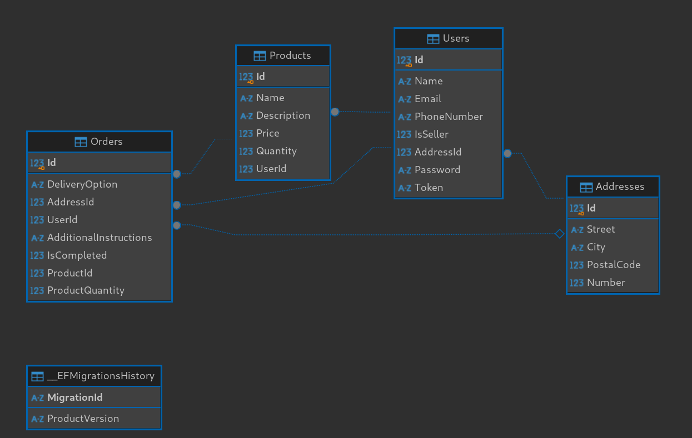

# ECommerce API

- → English
- [Português](README.pt-br.md)

## About

Supervised Practical Activity (APS) for the subject _Architecture of IoT and Cloud Computing Systems_ in the Software Engineering course at UniSenai. The project consists of a RESTful API for an e-commerce system, featuring Users, Products, and Orders.

### Team Members

- [André Luis](https://github.com/AndreLuisPLuz)
- [Leonardo Correa](https://github.com/leocorrea25)
- [Paulo Lisecki](https://github.com/thinato)

## Dependencies

```
dotnet-sdk >= 8.0
mssql-server >= 15.0 (2019)
```

## Entity-Relationship Diagram

<!--  -->


## How to Use

```bash
git clone https://github.com/leocorrea25/APS1
cd APS1
```

## Update the Connection String

Update the connection string in the BookingService/Consumers/API/appsettings.json file with your SQL Server instance.

```json
{
  "ConnectionStrings": {
    "DefaultConnection": "Server=localhost;Database=ecommerce;User Id=sa;Password=your_password;"
  }
}
```

## Run the Project

```bash
dotnet run --project BookingService/Consumers/API/API.csproj
```

## Test the API

Access the URL `https://localhost:5001/swagger` to test the API, or use your favorite HTTP client. All requests will be documented using cURL.

[Endpoint Documentation](./docs/en-us/menu.md)
