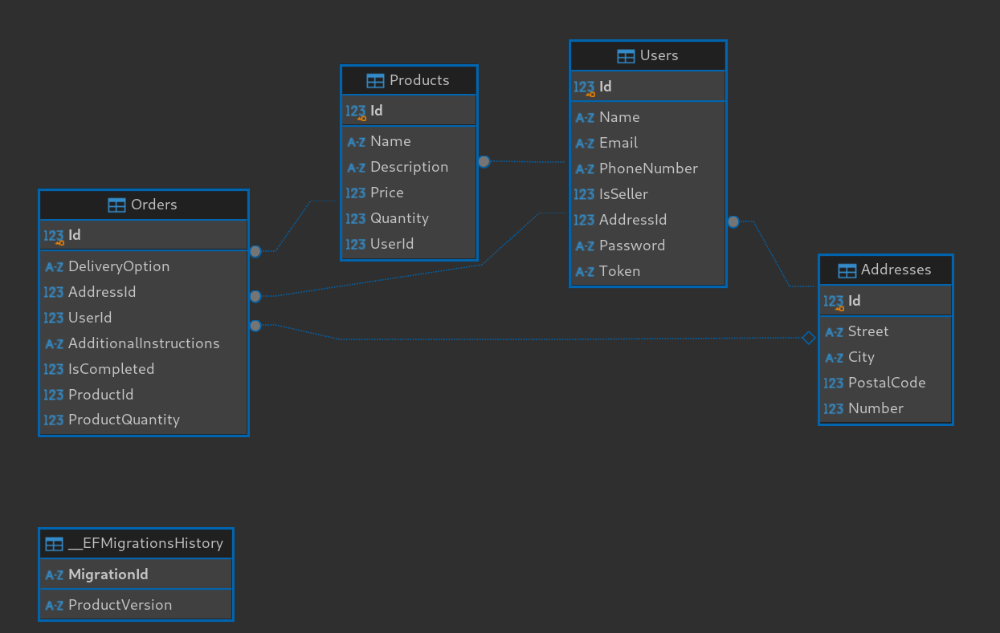
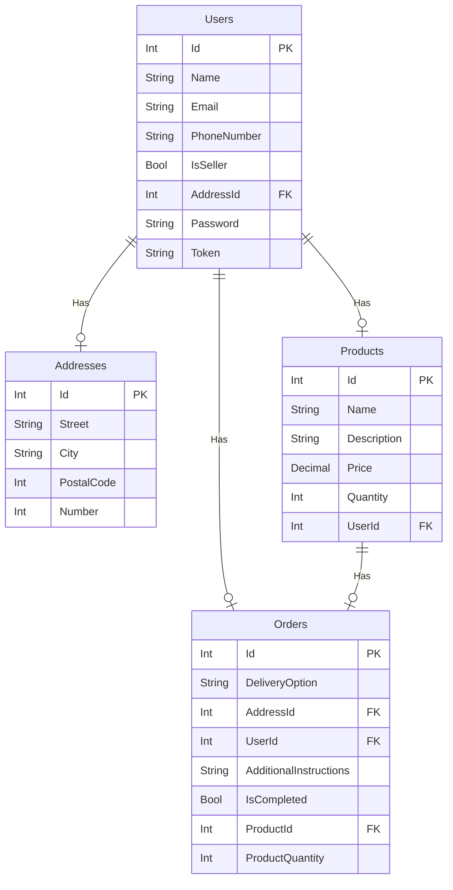

# ECommerce API

- [English](README.md)
- → Português

## Sobre

Atividade Prática Supervisionada (APS) da disciplina de Arquitetura de Sistemas IoT e Cloud Computig do curso de Engenharia de Software do UniSenai. O projeto consiste em uma API RESTful para um sistema de e-commerce, com Usuários, Produtos e Pedidos.

### Integrantes

- [André Luis](https://github.com/AndreLuisPLuz)
- [Leonardo Correa](https://github.com/leocorrea25)
- [Paulo Lisecki](https://github.com/thinato)

## Dependências

```
dotnet-sdk >= 8.0
mssql-server >= 15.0 (2019)
```

## Diagrama de Entidade-Relacionamento

<!--  -->



## Como Usar

### Clonar o Repositório

```bash
git clone https://github.com/leocorrea25/APS1
cd APS1
```

### Altere a Connection String

Altere a connection string no arquivo `BookingService/Consumers/API/appsettings.json` para a sua instância do SQL Server.

```json
{
  "ConnectionStrings": {
    "DefaultConnection": "Server=localhost;Database=ecommerce;User Id=sa;Password=sua_senha;"
  }
}
```

### Executar o Projeto

```bash
dotnet run --project BookingService/Consumers/API/API.csproj
```

### Testar a API

Acesse a URL `https://localhost:5001/swagger` para testar a API ou utilize o seu cliente HTTP favorito, todos os requests serao documentados atraves do cURL.

[Documentacao dos Endpoints](./docs/endpoints.md)
